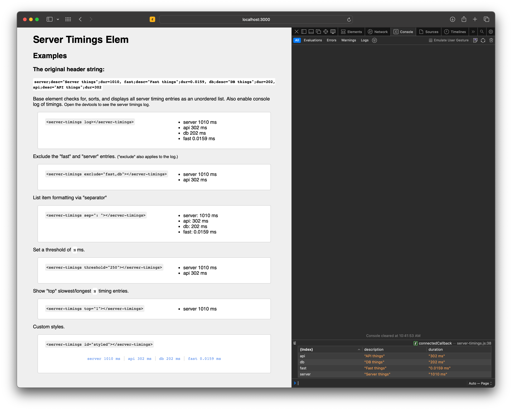

<h1 align="center"><code>server-timings-elem</code> ⌚️</h1>

<p align="center">
  <strong>HTML custom element for displaying Server-Timing headers</strong><br>
  Display timers from the document request with <code>&lt;server-timings&gt;&lt;/server-timings&gt;</code>.<br>
  <a href="https://www.npmjs.com/package/server-timings-elem"><strong><code>server-timings-elem</code> on npmjs.com »</strong></a><br>
  <br>
  Contents:
  <a href="#Install">Install</a>
  •
  <a href="#Usage">Usage</a>
  •
  <a href="#Links">Links</a>
</p>



## Install

Get the `server-timings.js` file to your webpage.

Grab it from GitHub or via npm:

```sh
npm install server-timings-elem
```

## Usage

Include the `<server-timings></server-timings>` element in your HTML document. The element will render as an unstyled `<ul>`.

```html
<server-timings></server-timings>

<server-timings log></server-timings>

<server-timings exclude="fast,db"></server-timings>

<server-timings sep=": "></server-timings>

<server-timings threshold="250"></server-timings>

<server-timings top="1"></server-timings>
```

Sample CSS for styling the element:

```css
server-timings {
  display: block;
}
server-timings ul {
  margin: 0;
  padding: 0;
  list-style: none;
  display: flex;
  flex-direction: row;
  justify-content: center;
  gap: 1.5rem;
}
```

## Links

[`header-timers`](https://npmjs.com/package/header-timers) - Node.js module for creating Server-Timing headers

[`Server-Timing` reference](https://developer.mozilla.org/en-US/docs/Web/HTTP/Headers/Server-Timing) MDN documentation on Server-Timing headers
